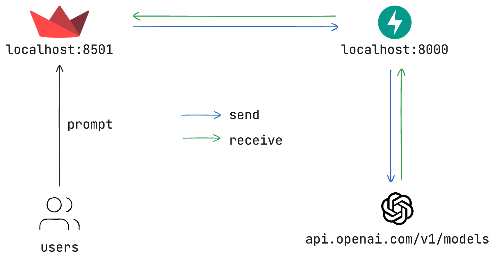

# ChatGPT-like Clone




## Overview
This project is a web application that uses Streamlit, FastAPI, and OpenAI API to create a chatbot.

## Features
- User can input messages and receive responses from the AI.
- Chat history is maintained across sessions.
- Supports multiple AI models (`gpt-4o-mini`, `gpt-4o`, `gpt-4`).

## Requirements
To run this application, please create a `.env` file with the following environment variable:
```bash
OPENAI_API_KEY=<your-openai-api-key>
```

Go to [OpenAI](https://platform.openai.com/api-keys) to get your API key.

Then install the dependencies (using [Poetry](https://python-poetry.org/)), you don't need to create a environment, it will manage it for you.
```bash
poetry install
```

## Running the Application

First start the backend service:
```bash
poetry run uvicorn backend.main:app --reload
```

Then start the frontend:

```bash
poetry run streamlit run frontend/app.py
```

## Usage
1. Open your web browser and navigate to the URL provided by Streamlit (usually `http://localhost:8501`).
2. Type your message in the input box and hit enter.
3. The AI's response will be displayed in the chat interface.
